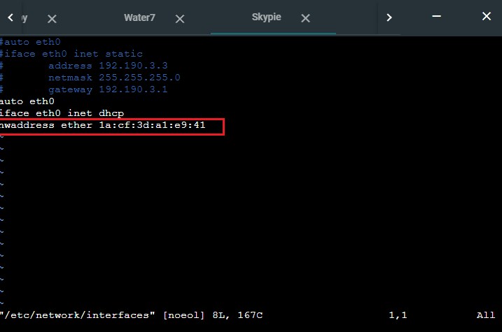
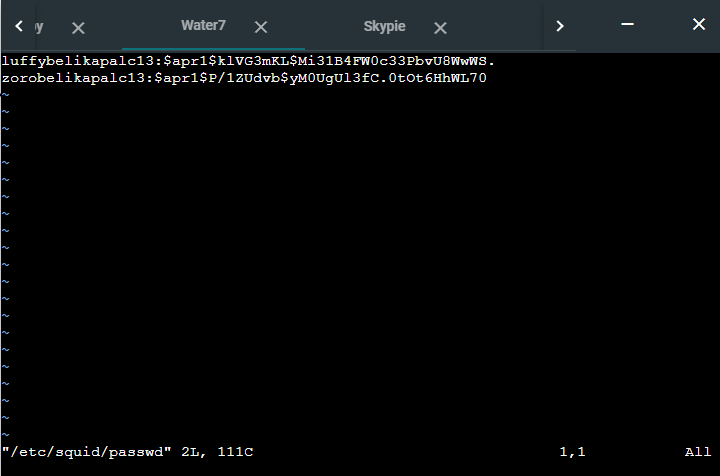

# Jarkom-Modul-3-C13-2021

## Anggota Kelompok :

| Anggota              | NRP            |
| -------------------- | -------------- |
| M. Auliya Mirzaq R.  | 05111940000065 |
| M. Akmal Joedhiawan  | 05111940000125 |
| M. Arsyad Ardiansyah | 05111940000228 |

## Soal

Luffy yang sudah menjadi Raja Bajak Laut ingin mengembangkan daerah kekuasaannya dengan membuat peta seperti berikut:


Luffy bersama Zoro berencana membuat peta tersebut dengan kriteria EniesLobby sebagai DNS Server, Jipangu sebagai DHCP Server, Water7 sebagai Proxy Server (1), dan Foosha sebagai DHCP Relay (2). Luffy dan Zoro menyusun peta tersebut dengan hati-hati dan teliti.

Ada beberapa kriteria yang ingin dibuat oleh Luffy dan Zoro, yaitu:

- Semua client yang ada HARUS menggunakan konfigurasi IP dari DHCP Server.
- Client yang melalui Switch1 mendapatkan range IP dari [prefix IP].1.20 - [prefix IP].1.99 dan [prefix IP].1.150 - [prefix IP].1.169 (3)
- Client yang melalui Switch3 mendapatkan range IP dari [prefix IP].3.30 - [prefix IP].3.50 (4)
- Client mendapatkan DNS dari EniesLobby dan client dapat terhubung dengan internet melalui DNS tersebut. (5)
- Lama waktu DHCP server meminjamkan alamat IP kepada Client yang melalui Switch1 selama 6 menit sedangkan pada client yang melalui Switch3 selama 12 menit. Dengan waktu maksimal yang dialokasikan untuk peminjaman alamat IP selama 120 menit. (6)

Luffy dan Zoro berencana menjadikan Skypie sebagai server untuk jual beli kapal yang dimilikinya dengan alamat IP yang tetap dengan IP [prefix IP].3.69 (7). Loguetown digunakan sebagai client Proxy agar transaksi jual beli dapat terjamin keamanannya, juga untuk mencegah kebocoran data transaksi.

Pada Loguetown, proxy harus bisa diakses dengan nama jualbelikapal.yyy.com dengan port yang digunakan adalah 5000 (8). Agar transaksi jual beli lebih aman dan pengguna website ada dua orang, proxy dipasang autentikasi user proxy dengan enkripsi MD5 dengan dua username, yaitu luffybelikapalyyy dengan password luffy_yyy dan zorobelikapalyyy dengan password zoro_yyy (9). Transaksi jual beli tidak dilakukan setiap hari, oleh karena itu akses internet dibatasi hanya dapat diakses setiap hari Senin-Kamis pukul 07.00-11.00 dan setiap hari Selasa-Jum’at pukul 17.00-03.00 keesokan harinya (sampai Sabtu pukul 03.00) (10).

Agar transaksi bisa lebih fokus berjalan, maka dilakukan redirect website agar mudah mengingat website transaksi jual beli kapal. Setiap mengakses google.com, akan diredirect menuju super.franky.yyy.com dengan website yang sama pada soal shift modul 2. Web server super.franky.yyy.com berada pada node Skypie (11).

Saatnya berlayar! Luffy dan Zoro akhirnya memutuskan untuk berlayar untuk mencari harta karun di super.franky.yyy.com. Tugas pencarian dibagi menjadi dua misi, Luffy bertugas untuk mendapatkan gambar (.png, .jpg), sedangkan Zoro mendapatkan sisanya. Karena Luffy orangnya sangat teliti untuk mencari harta karun, ketika ia berhasil mendapatkan gambar, ia mendapatkan gambar dan melihatnya dengan kecepatan 10 kbps (12). Sedangkan, Zoro yang sangat bersemangat untuk mencari harta karun, sehingga kecepatan kapal Zoro tidak dibatasi ketika sudah mendapatkan harta yang diinginkannya (13).

Keterangan :

- yyy adalah nama kelompok Anda
- Untuk nomor 9, harus htpasswd yang melakukan enkripsi
- Bisa melakukan wget https://raw.githubusercontent.com/FeinardSlim/Praktikum-Modul-2-Jarkom/main/super.franky.zip untuk mendapatkan file untuk super.franky.yyy.com

## Soal 1

Luffy bersama Zoro berencana membuat peta tersebut dengan kriteria EniesLobby sebagai DNS Server, Jipangu sebagai DHCP Server, Water7 sebagai Proxy Server.

Setting network configuration pada semua node sesuai dengan Prefix IP dari kelompok C13 yaitu `192.190`

#### Foosha

```
auto eth0
iface eth0 inet dhcp

auto eth1
iface eth1 inet static
	address 192.190.1.1
	netmask 255.255.255.0

auto eth2
iface eth2 inet static
	address 192.190.2.1
	netmask 255.255.255.0

auto eth3
iface eth3 inet static
	address 192.190.3.1
	netmask 255.255.255.0

```

#### EniesLobby (DNS Master)

```
auto eth0
iface eth0 inet static
	address 192.190.2.2
	netmask 255.255.255.0
	gateway 192.190.2.1

```

#### Water7 (Proxy Server)

```
auto eth0
iface eth0 inet static
	address 192.190.2.3
	netmask 255.255.255.0
	gateway 192.190.2.1

```

#### Jipangu (DHCP Server)

```
auto eth0
iface eth0 inet static
	address 192.190.2.4
	netmask 255.255.255.0
	gateway 192.190.2.1

```

## Soal 2

Dan Foosha sebagai DHCP Relay.

#### Node Foosha

- Lakukan update dengan `apt-get update`

- Install `isc-dhcp-relay` dengan perintah `apt-get install isc-dhcp-relay`

- Edit file DHCP relaynya dengan perintah `vim /etc/default/isc-dhcp-relay` lalu tambahkan `eth1 eth2 eth3` pada kolom `INTERFACES= `.

- Memasukkan IP Jipangu sebagai DHCP Servernya, yaitu `192.190.2.4`.

- Kosongkan kolom berikutnya.

## Soal 3

Ada beberapa kriteria yang ingin dibuat oleh Luffy dan Zoro, yaitu:

- Semua client yang ada HARUS menggunakan konfigurasi IP dari DHCP Server.
- Client yang melalui Switch1 mendapatkan range IP dari [prefix IP].1.20 - [prefix IP].1.99 dan [prefix IP].1.150 - [prefix IP].1.169h ke Skypie.

#### Node Jipangu

- Ketik `vim /etc/dhcp/dhcpd.conf` untuk mengedit file `dhcpd.conf`, lalu tambahkan beris berikut

  ```

  ```

- Restart service isc-dhcp-server dengan perintah `service isc-dhcp-server restart`

#### Node Loguetown

- Ketik `ip a` untuk melihat apakah ip DHCP server berhasil dipinjam seperti gambar berikut

## Soal 4

Client yang melalui Switch3 mendapatkan range IP dari [prefix IP].3.30 - [prefix IP].3.50.

#### Node Jipangu

- Ketik `vim /etc/dhcp/dhcpd.conf` untuk mengedit file `dhcpd.conf`, lalu tambahkan beris berikut

  ```

  ```

- Restart service isc-dhcp-server dengan perintah `service isc-dhcp-server restart`

Node TotoLand

- Ketik `ip a` untuk melihat apakah ip DHCP server berhasil dipinjam seperti gambar berikut

## Soal 5

Client mendapatkan DNS dari EniesLobby dan client dapat terhubung dengan internet melalui DNS tersebut.

#### Node EnniesLobby

- Tambahkan perintah pada `/etc/bind/named.conf.options` seperti baris berikut

```
options {
        directory "/var/cache/bind";

        // If there is a firewall between you and nameservers you want
        // to talk to, you may need to fix the firewall to allow multiple
        // ports to talk.  See http://www.kb.cert.org/vuls/id/800113

        // If your ISP provided one or more IP addresses for stable
        // nameservers, you probably want to use them as forwarders.
        // Uncomment the following block, and insert the addresses replacing
        // the all-0s placeholder.

        forwarders {
                192.168.122.1;
        };

        //========================================================================
        // If BIND logs error messages about the root key being expired,
        // you will need to update your keys.  See https://www.isc.org/bind-keys
        //========================================================================
        //dnssec-validation auto;
	allow-query{any;};

        auth-nxdomain no;    # conform to RFC1035
        listen-on-v6 { any; };
};

```

#### Node Loguetown

- Edit file `interfaces` dengan perintah `vim /etc/network/interfaces` seperti berikut.

```
#auto eth0
#iface eth0 inet static
#       address 192.190.1.2
#       netmask 255.255.255.0
#       gateway 192.190.1.1
auto eth0
iface eth0 inet dhcp
```

- Cek nameserver pada file `vim /etc/resolv.conf`.

#### Node Alabasta

- Edit file `interfaces` dengan perintah `vim /etc/network/interfaces` seperti berikut.

```
#auto eth0
#iface eth0 inet static
#       address 192.190.1.3
#       netmask 255.255.255.0
#       gateway 192.190.1.1
auto eth0
iface eth0 inet dhcp
```

- Cek nameserver pada file `vim /etc/resolv.conf`.

#### Node Tottoland

- Edit file `interfaces` dengan perintah `vim /etc/network/interfaces` seperti berikut.

```
#auto eth0
#iface eth0 inet static
#       address 192.190.3.2
#       netmask 255.255.255.0
#       gateway 192.190.3.1
auto eth0
iface eth0 inet dhcp
```

- Cek nameserver pada file `vim /etc/resolv.conf`.

#### Node Skypie

- Edit file `interfaces` dengan perintah `vim /etc/network/interfaces` seperti berikut.

```
#auto eth0
#iface eth0 inet static
#       address 192.190.3.3
#       netmask 255.255.255.0
#       gateway 192.190.3.1
auto eth0
iface eth0 inet dhcp
```

- Cek nameserver pada file `vim /etc/resolv.conf`.

## Soal 6

Lama waktu DHCP server meminjamkan alamat IP kepada Client yang melalui Switch1 selama 6 menit sedangkan pada client yang melalui Switch3 selama 12 menit. Dengan waktu maksimal yang dialokasikan untuk peminjaman alamat IP selama 120 menit.

#### Node Jipangu

- Edit file `dhcpd.conf` dengan perintah `vim /etc/dhcp/dhcpd.conf`
- Ubah kode `default-lease-time 600;` menjadi `default-lease-time 360;` pada subnet `192.190.1.0` (Switch1).
- Ubah kode `default-lease-time 600;` menjadi `default-lease-time 720;` pada subnet `192.190.3.0` (Switch3)
- Lalu untuk hasilnya akan seperti gambar berikut

  

## Soal 7

Luffy dan Zoro berencana menjadikan Skypie sebagai server untuk jual beli kapal yang dimilikinya dengan alamat IP yang tetap dengan IP [prefix IP].3.69.

#### Node Jipangu

- Edit file `dhcpd.conf` dengan perintah `vim /etc/dhcp/dhcpd.conf` dan tambahkan baris berikut.

  ```
  host Skypie {
    hardware ethernet 1a:cf:3d:a1:e9:41;
    fixed-address 192.190.3.69;
  }
  ```

  

- Cek `link/ether` `eth0` di Node Skypie dengan menjalankan perintah `ip a` untuk mendapatkan Hardware Ethernet.
- Restart service DHCP Server dengan perintah `service isc-dhcp-server restart`.

#### Node Skypie

- Edit file `interfaces` dengan perintah `vim /etc/network/interfaces` dan tambahkan baris berikut

  ```
  hwaddress ether 1a:cf:3d:a1:e9:41
  ```

  

- Restart Node Skypie.
- Cek apakah IP sudah berubah dengan perintah `ip a`.

## Soal 8

Loguetown digunakan sebagai client Proxy agar transaksi jual beli dapat terjamin keamanannya, juga untuk mencegah kebocoran data transaksi.Pada Loguetown, proxy harus bisa diakses dengan nama jualbelikapal.yyy.com dengan port yang digunakan adalah 5000.

#### Node Water7

- Lakukan update dengan perintah `apt-get update`.
- Install Squid dengan perintah `apt-get install squid`.
- Edit file `squid.conf` dengan perintah `vim /etc/squid/squid.conf` seperti berikut.

  ```
  http_port 5000
  visible_hostname jualbelikapal.c13.com

  http_access allow all
  ```

  

- Restart service squid dengan perintah `service squid restart`.

#### Node Loguetown

- Kemudian pada node client, yaitu Loguetown jalankan perintah berikut untuk mengaktifkan proxynya
  ```
  export http_proxy="http://192.190.2.3:5000"
  ```

## Soal 9

Agar transaksi jual beli lebih aman dan pengguna website ada dua orang, proxy dipasang autentikasi user proxy dengan enkripsi MD5 dengan dua username, yaitu luffybelikapalyyy dengan password luffy_yyy dan zorobelikapalyyy dengan password zoro_yyy.

#### Node Water7

- Lakukan update dengan perintah `apt-get update`.
- Install `Apache Utils` dengan perintah `apt-get install apache2-utils`.
- Ketikkan perintah dibawah untuk menambahkan username dan password. Agar bisa terenkripsi MD5 maka tambahkan `-m` dan hilangkan `-c` untuk menghindari membuat file baru. Lalu ada `-b` yang berfungsi agar bisa langsung memasukkan password

  ```
  htpasswd -cbm /etc/squid/passwd luffybelikapalc13 luffy_c13
  htpasswd -bm /etc/squid/passwd zorobelikapalc13 zoro_c13
  ```

- Edit file `squid.conf` dengan perintah `vim /etc/squid/squid.conf` seperti berikut.

  ```
  http_port 5000
  visible_hostname jualbelikapal.c13.com

  auth_param basic program /usr/lib/squid/basic_ncsa_auth /etc/squid/passwd
  auth_param basic children 5
  auth_param basic realm Proxy
  auth_param basic credentialsttl 2 hours
  auth_param basic casesensitive on
  acl USERS proxy_auth REQUIRED

  http_access allow USERS
  ```

  

- Cek apakah password sudah terenkripsi di file `/etc/squid/passwd`.
  
- Restart service squid dengan perintah `service squid restart`.

#### Node Loguetown

- Untuk mengeceknya kita bisa mengakses website melalui node Loguetown dengan perintah `lynx super.franky.c13.com`. Jika berhasil maka akan muncul autentikasi

  

## Soal 10

Transaksi jual beli tidak dilakukan setiap hari, oleh karena itu akses internet dibatasi hanya dapat diakses setiap hari Senin-Kamis pukul 07.00-11.00 dan setiap hari Selasa-Jum’at pukul 17.00-03.00 keesokan harinya (sampai Sabtu pukul 03.00).

#### Node Water7

- Edit file `squid.conf` dengan perintah `vim /etc/squid/squid.conf` seperti berikut.

  ```
  acl AVAILABLE_WORKING_1 time MTWH 07:00-11:00
  acl AVAILABLE_WORKING_2 time TWHF 17:00-23:59
  acl AVAILABLE_WORKING_3 time WHFA 00:00-03:00

  dns_nameservers 192.190.2.2
  http_port 5000
  visible_hostname jualbelikapal.c13.com

  auth_param basic program /usr/lib/squid/basic_ncsa_auth /etc/squid/passwd
  auth_param basic children 5
  auth_param basic realm Proxy
  auth_param basic credentialsttl 2 hours
  auth_param basic casesensitive on
  acl USERS proxy_auth REQUIRED

  http_access allow USERS AVAILABLE_WORKING_1
  http_access allow USERS AVAILABLE_WORKING_2
  http_access allow USERS AVAILABLE_WORKING_3

  http_access deny all
  ```

  

- Restart service squid dengan perintah `service squid restart`.

#### Node Loguetown

- Untuk mengeceknya kita bisa mengakses website melalui node Loguetown dengan perintah `lynx super.franky.c13.com`. Jika diluar jam kerja maka website tidak bisa diakses(_Forbidden_)

  

## Soal 11

Agar transaksi bisa lebih fokus berjalan, maka dilakukan redirect website agar mudah mengingat website transaksi jual beli kapal. Setiap mengakses google.com, akan diredirect menuju super.franky.yyy.com dengan website yang sama pada soal shift modul 2. Web server super.franky.yyy.com berada pada node Skypie.

#### Node EniesLobby

- Buat domain untuk `super.franky.c13.com` dengan menambahkan baris berikut di `/etc/bind/named.conf.local`

  ```
  zone "super.franky.c13.com"{
        type master;
        file "/etc/bind/jarkom/super.franky.c13.com";
  };
  ```

- Buat direktori untuk file konfigurasinya dengan perintah berikut

  ```
  mkdir jarkom
  ```

- Lalu atur konfigurasinya pada file `/etc/bind/jarkom/super.franky.c13.com` menjadi seperti ini

  ```
  $TTL    604800
  @       IN      SOA     super.franky.c13.com. root.super.franky.c13.com. (
                                2         ; Serial
                          604800         ; Refresh
                            86400         ; Retry
                          2419200         ; Expire
                          604800 )       ; Negative Cache TTL
  ;
  @       IN      NS      super.franky.c13.com.
  @       IN      A       192.190.3.69
  www     IN      CNAME   super.franky.c13.com.
  ```

  

- Kemudian restart service dari bind9 dengan perintah
  ```
  service bind9 restart
  ```

#### Node Skypie

- Pertama dengan install webserver apache2, wget, dan unzip dengan perintah berikut

  ```
  apt-get update
  apt-get install apache2 wget unzip -y
  ```

- Kemudian mengatur konfigurasi webserver nya dengan edit file di `/etc/apache2/sites-available/super.franky.c13.com.conf` menjadi seperti berikut

  ```
  <VirtualHost *:80>
          ServerAdmin webmaster@localhost
          DocumentRoot /var/www/super.franky
          ServerName super.franky.c13.com
          ServerAlias www.super.franky.c13.com

          ErrorLog ${APACHE_LOG_DIR}/error.log
          CustomLog ${APACHE_LOG_DIR}/access.log combined
  </VirtualHost>
  ```

- Lalu aktifkan konfigurasi nya dengan perintah berikut

  ```
  a2ensite super.franky.c13.com
  ```

- Restart service apache

  ```
  service apache2 restart
  ```

- Download file assets website dengan menggunakan wget

  ```
  wget -P /var/www https://raw.githubusercontent.com/FeinardSlim/Praktikum-Modul-2-Jarkom/main/super.franky.zip
  ```

- Unzip file yang sudah didownload
  ```
  unzip /var/www/super.franky.zip -d /var/www/
  ```

#### Node Water7

- Edit file `squid.conf` dengan perintah `vim /etc/squid/squid.conf` seperti berikut.

  ```
  acl AVAILABLE_WORKING_1 time MTWH 07:00-11:00
  acl AVAILABLE_WORKING_2 time TWHF 17:00-23:59
  acl AVAILABLE_WORKING_3 time WHFA 00:00-03:00

  dns_nameservers 192.190.2.2
  http_port 5000
  visible_hostname jualbelikapal.c13.com

  auth_param basic program /usr/lib/squid/basic_ncsa_auth /etc/squid/passwd
  auth_param basic children 5
  auth_param basic realm Proxy
  auth_param basic credentialsttl 2 hours
  auth_param basic casesensitive on
  acl USERS proxy_auth REQUIRED

  acl pindah dstdomain .google.com
  deny_info http://super.franky.c13.com pindah
  http_reply_access deny pindah


  http_access allow USERS AVAILABLE_WORKING_1
  http_access allow USERS AVAILABLE_WORKING_2
  http_access allow USERS AVAILABLE_WORKING_3

  http_access deny all
  ```

  

- Restart service squid dengan perintah `service squid restart`.

#### Node Loguetown

- Untuk mengecek apakah berhasil redirect, kita bisa akses google dengan perintah `lynx google.com` di node Loguetown. Maka akan langsung di redirect ke `super.franky.c13.com`

  

## Soal 12

Saatnya berlayar! Luffy dan Zoro akhirnya memutuskan untuk berlayar untuk mencari harta karun di super.franky.yyy.com. Tugas pencarian dibagi menjadi dua misi, Luffy bertugas untuk mendapatkan gambar (.png, .jpg), sedangkan Zoro mendapatkan sisanya. Karena Luffy orangnya sangat teliti untuk mencari harta karun, ketika ia berhasil mendapatkan gambar, ia mendapatkan gambar dan melihatnya dengan kecepatan 10 kbps.

#### Node Water7

- Tambahkan perintah berikut ke dalam file `/etc/squid/squid.conf` seperti gambar dibawah ini

```
acl AVAILABLE_WORKING_1 time MTWH 07:00-11:00
acl AVAILABLE_WORKING_2 time TWHF 17:00-24:00
acl AVAILABLE_WORKING_3 time WHFA 00:00-03:00

dns_nameservers 192.190.2.2

acl download url_regex -i \.png$ \.jpg$
http_port 5000
visible_hostname jualbelikapal.c13.com

auth_param basic program /usr/lib/squid/basic_ncsa_auth /etc/squid/passwd
auth_param basic children 5
auth_param basic realm Proxy
auth_param basic credentialsttl 2 hours
auth_param basic casesensitive on
acl USERS proxy_auth REQUIRED

acl pindah dstdomain .google.com
deny_info http://super.franky.c13.com pindah
http_reply_access deny pindah

delay_pools 2

delay_class 1 1
delay_parameters 1 -1/-1
delay_access 1 deny all

delay_class 2 1
delay_parameters 2 10000/5000000
delay_access 2 allow download
delay_access 2 deny all


http_access allow USERS AVAILABLE_WORKING_1
http_access allow USERS AVAILABLE_WORKING_2
http_access allow USERS AVAILABLE_WORKING_3


http_access deny all
```


- Restart service squid

#### Node Loguetown

- Uji dengan mendownload file berekstensi `.png` atau `.jpg` terlihat seperti gambar dibawah ini apabila delay bandwith berhasil
  

## Soal 13

Sedangkan, Zoro yang sangat bersemangat untuk mencari harta karun, sehingga kecepatan kapal Zoro tidak dibatasi ketika sudah mendapatkan harta yang diinginkannya.

#### Node Water7

- Tambahkan perintah berikut ke dalam file `/etc/squid/squid.conf` seperti gambar dibawah ini

```
acl AVAILABLE_WORKING_1 time MTWH 07:00-11:00
acl AVAILABLE_WORKING_2 time TWHF 17:00-24:00
acl AVAILABLE_WORKING_3 time WHFA 00:00-03:00

dns_nameservers 192.190.2.2

acl download url_regex -i \.png$ \.jpg$
http_port 5000
visible_hostname jualbelikapal.c13.com

auth_param basic program /usr/lib/squid/basic_ncsa_auth /etc/squid/passwd
auth_param basic children 5
auth_param basic realm Proxy
auth_param basic credentialsttl 2 hours
auth_param basic casesensitive on
acl USERS proxy_auth REQUIRED

acl pindah dstdomain .google.com
deny_info http://super.franky.c13.com pindah
http_reply_access deny pindah

delay_pools 2

delay_class 1 1
delay_parameters 1 -1/-1
delay_access 1 deny all

delay_class 2 1
delay_parameters 2 10000/5000000
delay_access 2 allow download
delay_access 2 deny all


http_access allow USERS AVAILABLE_WORKING_1
http_access allow USERS AVAILABLE_WORKING_2
http_access allow USERS AVAILABLE_WORKING_3


http_access deny all
```


- Restart service squid

#### Node Loguetown

- Uji dengan mendownload file selain berekstensi `.png` atau `.jpg` terlihat seperti gambar dibawah ini


- Karena speed tidak dibatasi tidak terlihat kecepatan downloadnya karena file yang didownload tidak terlalu besar ukurannya
